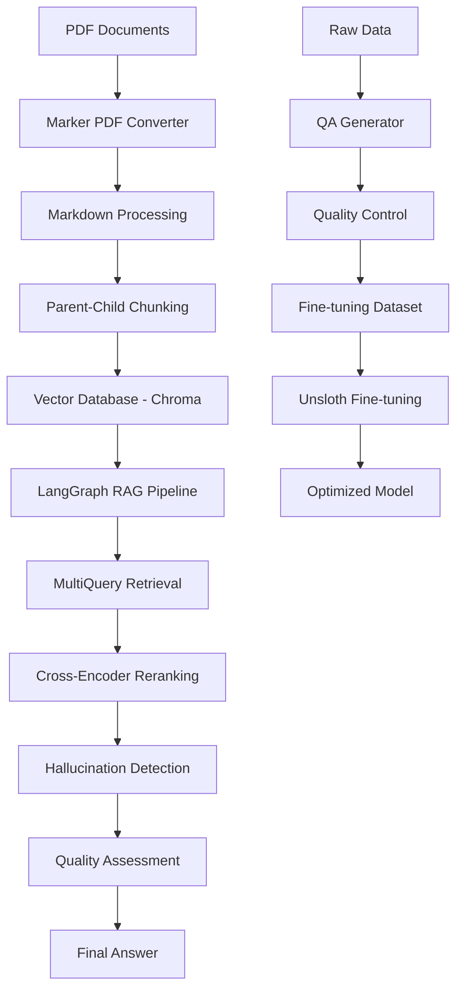

## About the Project

# Oracle SCM RAG System


> This system is a customized **Retrieval-Augmented Generation (RAG)** solution for advanced search and response generation on Oracle Supply Chain Management (SCM) documentation. It extracts meaningful content from PDF-based documents, generates intelligent multi-queries, and provides contextually relevant, reliable answers to users.

The system not only uses general LLMs but is also supported by an **LLM model fine-tuned specifically for the Oracle SCM domain**. This ensures:
- More accurate results
- Fewer hallucinations
- Faster and more meaningful information access.

With LangGraph, a flow-controlled structure is established, automating steps like data processing, query generation, hallucination detection, and quality assessment in a pipeline format.


### Key Features

- **RAG Pipeline**: MultiQuery + Cross-Encoder + Parent-Child Mapping
- **LangGraph Integration**: Complex workflow management
- **Fine-tuning Support**: Model training optimized with Unsloth
- **PDF Processing**: Markdown conversion with Marker
- **Quality Control**: Automated QA quality assessment

## System Architecture



## Project Structure

```
 oracle-rag-system/
├──  src/                     
│   ├──  graph.py                  
│   ├── 🔧 fine_tuning.py           
│   ├──  dataquality.py           
│   ├──  pdf_qa_generator.py      
│   ├──  ingestion.py            
│   ├──  metadata.py             
│   ├──  generated_prompt.py     
│   └──  run_marker.py          
├──  langgraph.json              
├──  requirements.txt            
├──  .gitignore                   
└──  README.md                    
```

## Installation

### Prerequisites

- **Python 3.9+**
- **CUDA** (for GPU support)
- **Ollama** (for local LLMs)
- **Git**

### 1. Clone the Repository

```bash
git clone https://github.com/yourusername/oracle-rag-system.git
cd oracle-rag-system
```

### 2. Create a Virtual Environment

```bash
python -m venv venv
source venv/bin/activate  
# or
venv\Scripts\activate     
```

### 3. Install Dependencies

```bash
pip install -r requirements.txt
```

### 4. Install and Start Ollama

```bash
curl -fsSL https://ollama.ai/install.sh | sh

ollama pull gemma2:2b
ollama pull Ahmet_Hamdi/oracle_final_deepseek:latest
```

### 5. Set Environment Variables

```bash
echo "TAVILY_API_KEY=your_tavily_api_key_here" > .env
```

## 📖 User Guide

###  1. Convert PDFs to Markdown

```bash
python src/run_marker.py -i your_pdf_file.pdf -o output_directory
```

**Features:**
- Table and text extraction

### 2. Document Processing and Vectorization

```bash
python src/ingestion.py
```

**Functions:**
- Markdown cleaning
- Parent-Child chunking strategy
- Chroma vector database integration
- High-quality content filtering

###  3. Start the RAG System

```bash
langgraph dev --allow-blocking

python src/graph.py
```

**RAG Pipeline Features:**
- **MultiQuery Expansion**: Generates 5 alternative queries
- **Cross-Encoder Reranking**: Reranking with BAAI/bge-reranker-base
- **Parent Document Mapping**: Contextual information expansion
- **Hallucination Detection**: 3-model voting system
- **Quality Assessment**: Two-tier quality evaluation

### 4. Generate QA Dataset

```bash
python src/pdf_qa_generator.py
```

**Features:**
- Intelligent chunk splitting
- Automated quality assessment
- JSON format output
- Batch processing support

### 5. Model Fine-tuning

```bash
python src/fine_tuning.py
```

**Fine-tuning Features:**
- **Unsloth optimization**: 2x faster training
- **DoRA (Weight-Decomposed Low-Rank Adaptation)** technique
- Automatic model merging and uploading to Hub
- Comprehensive error management

## Technical Details

### RAG Pipeline Components

#### 1. **Retrieval Strategy**
```python
# MultiQuery + Cross-Encoder + Parent Mapping
ENABLE_MULTIQUERY = True
ENABLE_CROSS_ENCODER = True
RERANK_TOP_N = 8
DIVERSITY_FACTOR = True
```

#### 2. **Quality Assessment**
- **Oracle SCM Consultant Standards**: Technical accuracy
- **Unbiased Quality Assessment**: General communication quality
- **Consensus Mechanism**: Two-tier approval system

#### 3. **Hallucination Detection**
- 3-model voting system
- Web verification support
- Dynamic threshold adjustment

### Fine-tuning Configuration

```python
MODEL_NAME = "Qwen/Qwen2-1.5B-Instruct"
MAX_SEQ_LENGTH = 2048
DORA_RANK = 16
DORA_ALPHA = 32
```

**Supported Models:**
- Qwen2-1.5B-Instruct
- Llama-3.2-3B-Instruct
- Custom Oracle-optimized models


